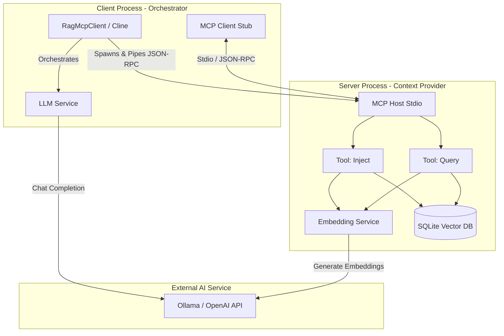
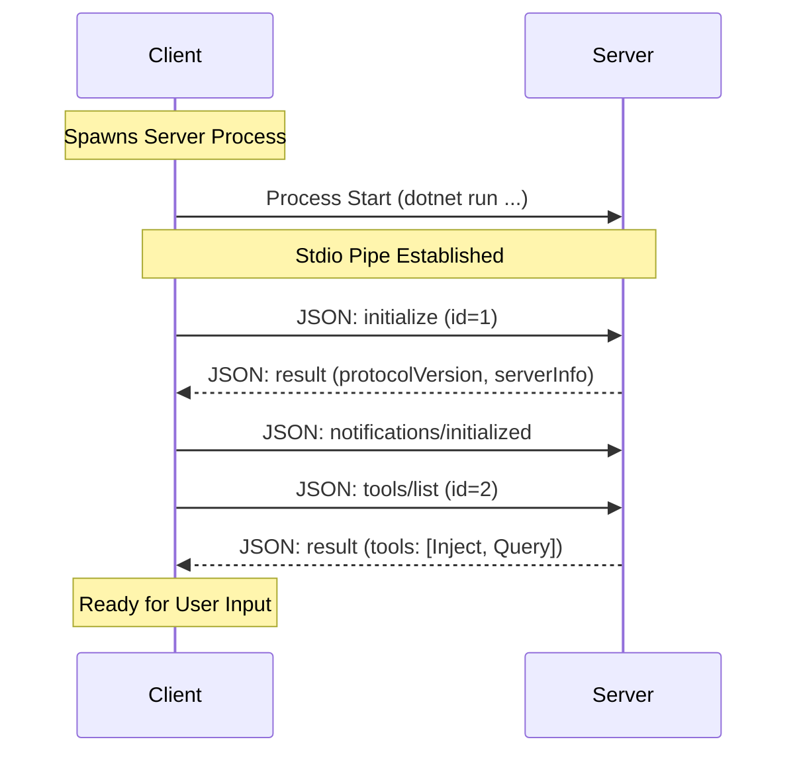
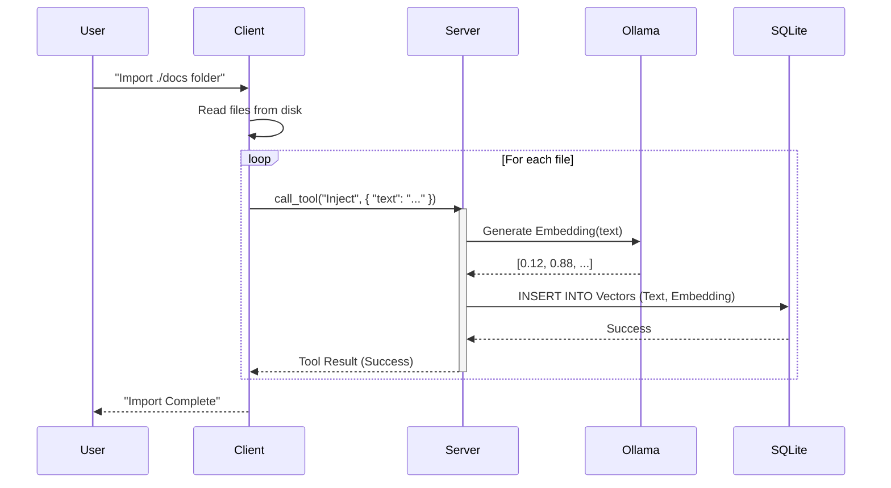
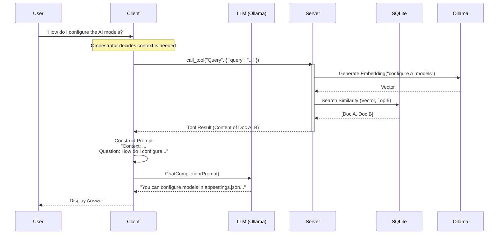

# Technical Architecture & Design

This document outlines the technical details, architecture, and data flows of the **RagMcpServer** project.

## Overview

The project implements a **Retrieval-Augmented Generation (RAG)** system based on the **Model Context Protocol (MCP)**. It follows a strict separation of concerns where the Server acts purely as a Context Provider (Knowledge Base), and the Client (or an AI Agent like Cline) acts as the Orchestrator/Intelligence.

### Core Technologies

-   **Language**: C# (.NET 8)
-   **Protocol**: Model Context Protocol (MCP) via Standard Input/Output (Stdio)
-   **Vector Store**: SQLite (with vector extensions/logic)
-   **AI Framework**: Microsoft Semantic Kernel
-   **AI Provider**: Ollama (for local Embeddings and LLM)

## System Architecture

The system consists of two main process boundaries communicating via Stdio.

## Key Components

### 1. RagMcpServer (The Context Provider)
-   **Responsibility**: Manages the knowledge base. It does *not* know about the user's intent or chat history. It simply executes specific tools requested by the client.
-   **Communication**: Listens on `stdin`, writes to `stdout`. Logs are written to `stderr`.
-   **Tools**:
    -   `Inject`: Accepts text, generates an embedding (via Ollama), and stores it in SQLite.
    -   `Query`: Accepts a query string, generates an embedding, and performs cosine similarity search in SQLite.

### 2. RagMcpClient (The Orchestrator)
-   **Responsibility**: Interacts with the user, manages conversation history, and decides *when* to call server tools.
-   **Lifecycle**: Spawns the `RagMcpServer` executable as a subprocess.
-   **Logic**:
    1.  Receives user input.
    2.  Check if tools (RAG) are needed (often determined by the LLM or heuristics).
    3.  Call `Query` tool on Server if needed.
    4.  Construct a prompt with retrieved context.
    5.  Send to LLM for final answer.

## AI & Data Layer Details

### 1. Vector Database Strategy
The project uses **SQLite** for persistence, prioritizing portability and zero-configuration.

*   **Storage Format**: Vectors are stored as **BLOBs** (Binary Large Objects). Each BLOB contains a serialized array of 32-bit floating-point numbers (`float[]`).
*   **Search Implementation**:
    *   *Current*: **In-Memory Cosine Similarity**. The server loads all embeddings from the DB into memory and uses .NET 8's hardware-accelerated `TensorPrimitives.CosineSimilarity` (SIMD support) to find the nearest neighbors. This provides extremely low latency for datasets up to ~10,000-50,000 documents without needing complex vector extensions.
    *   *Future*: Support for `sqlite-vec` can be added if the dataset exceeds memory constraints.

### 2. Embeddings Model
The system relies on an external Embedding Service to convert text into vectors.

*   **Provider**: Defaults to **Ollama** (running locally).
*   **Model**: Configurable in `appsettings.json` (Section: `AI:EmbeddingConfig`).
*   **Recommendation**: `nomic-embed-text` (High quality, 768d) or `all-minilm` (Fast, 384d).
*   **Dimensionality**: The vector database is agnostic to dimensionality, but the search logic assumes all vectors in the DB share the same dimension as the query vector.

### 3. Text Splitting (Chunking)
Before generating embeddings, large documents are split into smaller, manageable chunks to ensure relevance and fit within embedding model token limits. This process is handled by the `DocumentProcessingService`.

*   **Method**: Uses the Microsoft Semantic Kernel's `RecursiveCharacterTextSplitter`.
*   **Chunk Size**: Configurable via `appsettings.json` (e.g., `AI:TextSplitter:MaxTokensPerChunk`). Default is typically around **1024 tokens**.
*   **Overlap Size**: Configurable via `appsettings.json` (e.g., `AI:TextSplitter:OverlapTokens`). Default is typically around **128 tokens**.
*   **Rationale**: Overlapping chunks help maintain context across chunk boundaries, improving retrieval accuracy when relevant information spans multiple segments.

### 4. LLM (Large Language Model)
The LLM is the "Brain" utilized by the **Client** (Orchestrator).

*   **Role**: Synthesis and Reasoning. It takes the user's raw query + the *Context* retrieved by the Server, and generates the final response.
*   **Provider**: Defaults to **Ollama**.
*   **Isolation**: The **Server** process never communicates with the LLM (Chat Completion) directly. It only handles Embeddings. This strictly enforces the "Retrieval" responsibility.
*   **Prompt Engineering**: The Client is responsible for constructing the RAG prompt (e.g., "Answer the question based strictly on the following context...").

## Sequence Diagrams

### 1. Initialization & Handshake

When the Client starts, it launches the Server and establishes the MCP session.

### 2. Document Ingestion (Inject Tool)

The flow for adding new documents to the knowledge base.

### 3. RAG Query Flow

The full cycle of answering a user question using retrieved context.

## Data Schema (SQLite)

The `SqliteDbService` manages a simple schema for storing vectors.

| Column | Type | Description |
| :--- | :--- | :--- |
| `Id` | `TEXT (UUID)` | Primary Key |
| `Text` | `TEXT` | The raw content of the document segment. |
| `MetadataJson` | `TEXT` | JSON string containing source filename, timestamps, etc. |
| `Embedding` | `BLOB` | Serialized float array representing the vector. |

*Note: In the current implementation, we perform a brute-force cosine similarity search in memory after fetching rows, or use a SQLite extension if configured.*